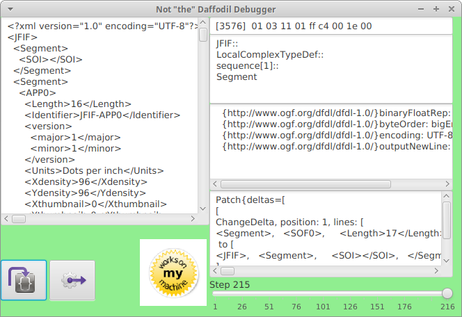

daffodil debugger experiments
===

Experiments with the Daffodil debugging interface, the DAP protocol and ScalaFX components.

Prototypes shouldnt be shiny :)



- [ZIO](https://zio.dev) application 
- rudimentary scalafx gui
- allows stepping through a schema parse via
  - manual step by step
  - automatic step every 100 millis
  - time traveling slider
- stateless views
  - display infoset at the current step
  - display the current bit position in the data with the corresponding value
  - display the current schema path being parsed
  - display the in-scope variables and their values
- stateful views
  - display the diff of current infoset against previous step
- Uses a snapshot from the current Daffodil master branch.

### model

Commands applied to the current ParseState produce Events.

- Producers send [`Command[E]`](src/main/scala/ddb/debugger/package.scala)
```
trait Command[E <: Event] {
  def run(state: PState, processor: Processor): ZIO[Any, Throwable, E]
}
```
- Sinks receive [`Event`](src/main/scala/ddb/debugger/package.scala), which are the product of a `Command` being applied to the processor state
```
trait Event
```
- Sinks and Producers are not connected


### reference
- https://github.com/apache/daffodil
- https://github.com/DFDLSchemas/JPEG
- https://github.com/apache/daffodil/pull/518
